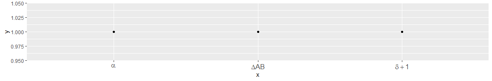

<!-- README.md is generated from README.Rmd. Please edit that file -->

# rjmb

<!-- badges: start -->

<!-- badges: end -->

The goal of rjmb is to provide some helper functions for data analysis
and visualization in R.

All the little things I run into end up
here.

## Installation

<!-- You can install the released version of rjmb from [CRAN](https://CRAN.R-project.org) with: -->

<!-- ``` r -->

<!-- install.packages("rjmb") -->

<!-- ``` -->

Install the development version from [GitHub](https://github.com/) with:

``` r
# install.packages("devtools")
devtools::install_github("jannikbuhr/rjmb")
```

## Example

This is a basic example which shows you how to solve a common problem:

``` r
library(rjmb)
library(tidyverse)
#> -- Attaching packages --------------------------------------------------------- tidyverse 1.2.1 --
#> v ggplot2 3.2.0     v purrr   0.3.2
#> v tibble  2.1.3     v dplyr   0.8.3
#> v tidyr   0.8.3     v stringr 1.4.0
#> v readr   1.3.1     v forcats 0.4.0
#> -- Conflicts ------------------------------------------------------------ tidyverse_conflicts() --
#> x dplyr::filter() masks stats::filter()
#> x dplyr::lag()    masks stats::lag()
## basic example code

df <- tibble(
  x = c("delta+1", "Delta AB", "alpha"),
  y = rep(1, length(x))
)

df %>%
  ggplot(aes(x, y)) +
  geom_point() +
  scale_x_discrete(labels = convert_to_math) +
  theme(axis.text.x = element_text(size = 12))
```


